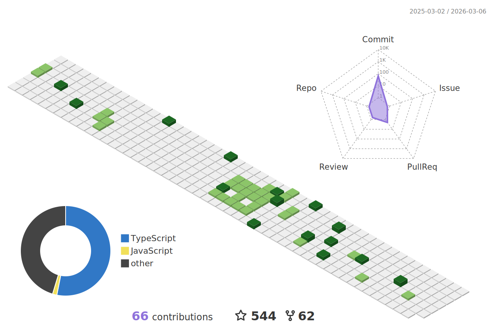

# Hi there 👋

<!-- REF https://github.com/denvercoder1/readme-typing-svg -->
<a href="https://github.com/denvercoder1/readme-typing-svg">
    <picture>
        <source media="(prefers-color-scheme: light)" srcset="https://readme-typing-svg.demolab.com?font=Fira+Code&size=16&pause=1000&vCenter=true&width=512&height=32&lines=%E8%BF%99%E6%98%AF%E4%B8%80%E5%9B%A2%E5%84%BF%E5%90%8D%E4%B8%BA%E2%80%9C%E4%BA%BA%E2%80%9D%E7%9A%84%E5%85%89%E7%90%83+%7C%C2%B4%EF%BD%A5-%EF%BD%A5);(%C2%B4%EF%BD%A5-%EF%BD%A5)%EF%BE%89+Here+is+a+ball+of+light+called+%E2%80%9Chuman%E2%80%9C&color=8F72DB">
        <source media="(prefers-color-scheme: dark)" srcset="https://readme-typing-svg.demolab.com?font=Fira+Code&size=16&pause=1000&vCenter=true&width=512&height=32&lines=%E8%BF%99%E6%98%AF%E4%B8%80%E5%9B%A2%E5%84%BF%E5%90%8D%E4%B8%BA%E2%80%9C%E4%BA%BA%E2%80%9D%E7%9A%84%E5%85%89%E7%90%83+%7C%C2%B4%EF%BD%A5-%EF%BD%A5);(%C2%B4%EF%BD%A5-%EF%BD%A5)%EF%BE%89+Here+is+a+ball+of+light+called+%E2%80%9Chuman%E2%80%9C&color=80A0C0">
        
    </picture>
</a>

<!-- 徽章 -->

 

<!-- 技术栈 -->

## Teck Stack

<!-- 语言 -->

### Languages

<!-- 框架 -->

### Frameworks

#### Web

#### Native

<!-- 数据库 -->

### Database

### AI

<!-- 开发运维 -->

### DevOps

#### OS

#### Virtual Environment

#### Shell

#### Browser

#### IDE

#### Editor

#### Code

#### Lint

#### Format

#### Package

#### Compiler

#### Runtime

#### Build

#### Test

#### Document

#### Deploy

#### CI/CD

#### Security

<!-- 统计 -->

## Stats

<!-- 使用的语言 -->
<!-- REF https://github.com/anuraghazra/github-readme-stats -->
<!--  -->
<a href="https://github.com/anuraghazra/github-readme-stats">
    <picture>
        <source media="(prefers-color-scheme: light)" srcset="https://github-readme-stats.vercel.app/api/top-langs/?username=Zuoqiu-Yingyi&layout=compact&langs_count=20&show_icons=true&hide=jupyter%20notebook&theme=buefy">
        <source media="(prefers-color-scheme: dark)" srcset="https://github-readme-stats.vercel.app/api/top-langs/?username=Zuoqiu-Yingyi&layout=compact&langs_count=20&show_icons=true&hide=jupyter%20notebook&theme=nord">
        
    </picture>
</a>
 

<!-- 统计信息 -->
<!-- REF https://github.com/anuraghazra/github-readme-stats -->
<a href="https://github.com/anuraghazra/github-readme-stats">
    <picture>
        <source media="(prefers-color-scheme: light)" srcset="https://github-readme-stats.vercel.app/api?username=Zuoqiu-Yingyi&show_icons=true&include_all_commits=true&theme=buefy&show=reviews,discussions_started,discussions_answered,prs_merged,prs_merged_percentage">
        <source media="(prefers-color-scheme: dark)" srcset="https://github-readme-stats.vercel.app/api?username=Zuoqiu-Yingyi&show_icons=true&include_all_commits=true&theme=nord&show=reviews,discussions_started,discussions_answered,prs_merged,prs_merged_percentage">
        
    </picture>
</a>
 

<!-- 连续提交 -->
<!-- REF https://github.com/denvercoder1/github-readme-streak-stats -->
<a href="https://github.com/denvercoder1/github-readme-streak-stats">
    <picture>
        <source media="(prefers-color-scheme: light)" srcset="https://github-readme-streak-stats.herokuapp.com?user=Zuoqiu-Yingyi&date_format=Y%2Fn%2Fj&border=E4E2E2&ring=8F72DB&currStreakNum=363636&currStreakLabel=7958D5&theme=buefy">
        <source media="(prefers-color-scheme: dark)" srcset="https://github-readme-streak-stats.herokuapp.com?user=Zuoqiu-Yingyi&date_format=Y%2Fn%2Fj&ring=7490AC&currStreakNum=D8DEE9&currStreakLabel=80A0C0&theme=nord">
        
    </picture>
</a>
 

<!-- 最近活动折线图 -->
<!-- REF https://github.com/Ashutosh00710/github-readme-activity-graph -->
<a href="https://github.com/Ashutosh00710/github-readme-activity-graph">
    <picture>
        <source media="(prefers-color-scheme: light)" srcset="https://github-readme-activity-graph.vercel.app/graph?username=Zuoqiu-Yingyi&radius=8&title_color=7958d5&bg_color=ffffff&color=363636&line=BCABEA&point=8F72DB&area=true&area_color=8F72DB">
        <source media="(prefers-color-scheme: dark)" srcset="https://github-readme-activity-graph.vercel.app/graph?username=Zuoqiu-Yingyi&radius=8&title_color=80A0C0&bg_color=2e3440&color=d8dee9&line=576A80&point=7490AC&area=true&area_color=7490AC">
        
    </picture>
</a>
 

<!-- 三维贡献热力图 -->
<!-- REF https://github.com/yoshi389111/github-profile-3d-contrib -->
<a href="https://github.com/yoshi389111/github-profile-3d-contrib">
    <picture>
        <source media="(prefers-color-scheme: light)" srcset="./profile-3d-contrib/profile-custom-light-season.svg">
        <source media="(prefers-color-scheme: dark)" srcset="./profile-3d-contrib/profile-custom-dark-blud.svg">
        
    </picture>
</a>
 
